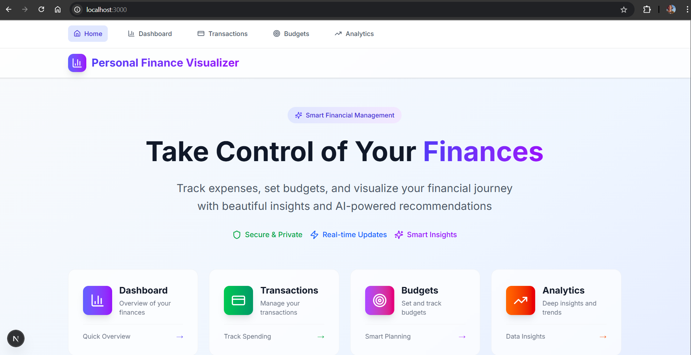
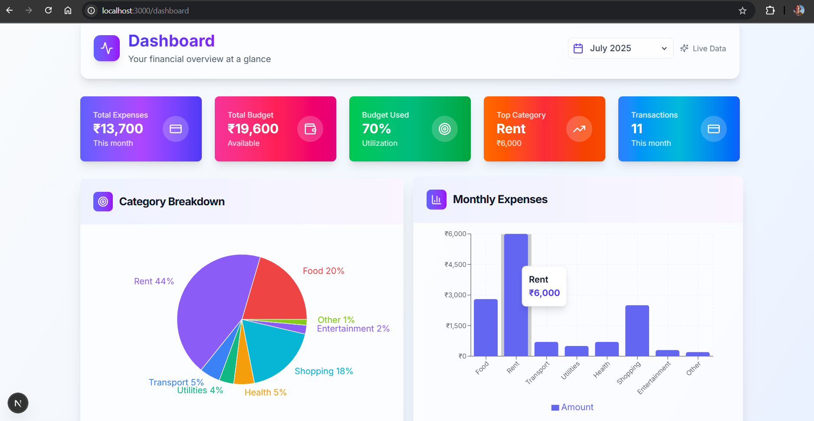
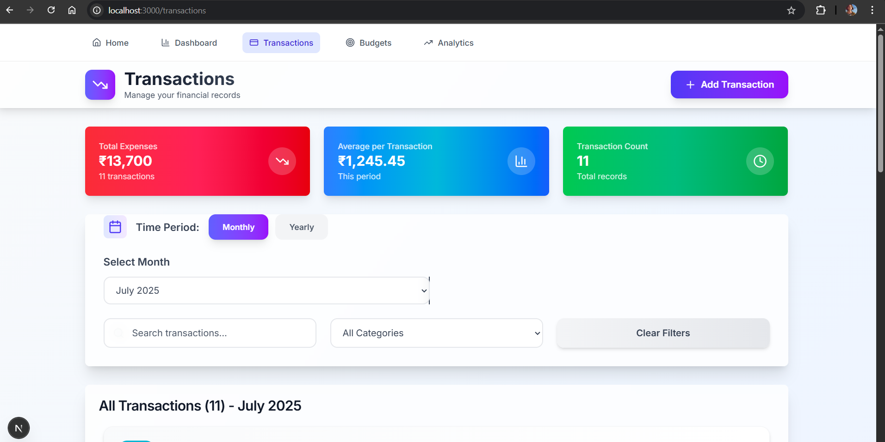
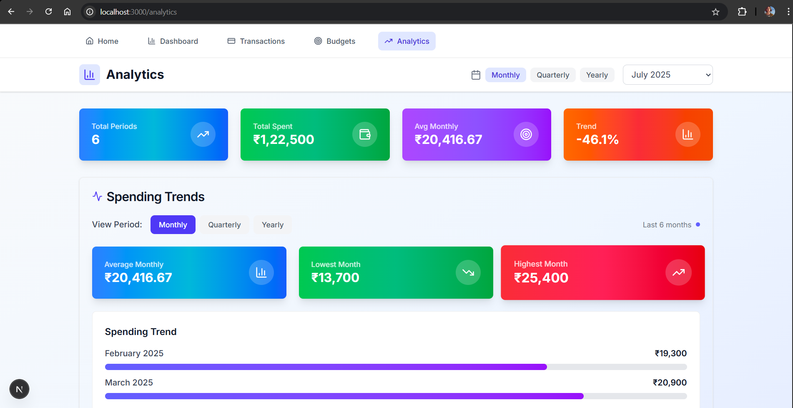

# 💰 Personal Finance Visualizer

A modern, responsive finance tracker built with **Next.js**, **React**, **shadcn/ui**, **Recharts**, and **MongoDB** to help users manage their personal finances with visual insights.

## 🚀 Submission Summary

- ✅ Submission Stage: **Stage 3**
- ✅ Fully responsive design
- ✅ No authentication (per guidelines)

## ✅ Features by Stage

### 🔹 Stage 1 – Basic Transaction Tracking
- Add, edit, and delete transactions (amount, date, description)
- Transaction list view
- Monthly expenses bar chart
- Basic form validation

### 🔹 Stage 2 – Categories
- Predefined categories
- Category-wise pie chart
- Dashboard: total expenses, category breakdown, latest transactions

### 🔹 Stage 3 – Budgeting
- Monthly budgets by category
- Budget vs actual comparison chart
- Spending insights and over-budget alerts

## 🛠️ Tech Stack

- **Frontend**: Next.js 15 (App Router), React, TypeScript, Tailwind CSS, shadcn/ui, Recharts
- **Backend**: Node.js, Express.js
- **Database**: MongoDB with Mongoose
- **UX**: Mobile-first responsive UI, error/loading states

## 📊 Key Highlights

- 📈 Real-time financial dashboards and analytics
- 🎨 Category-based color coding
- 📅 Time-based insights and trends
- 🧠 Smart budget visualizations and progress tracking
- 🚫 No login/signup (as per instructions)

## 📱 Application Screenshots

### **Dashboard Overview**

### **Transaction Management**

### **Analytics & Reports**

## 🧪 Evaluation Criteria Covered

- **Feature Implementation**: All features across Stage 1 to 3
- **Code Quality**: Modular, well-documented, with TypeScript
- **UI/UX**: Clean, responsive, and interactive design

## 🔗 Links

- **GitHub Repository**: [Personal-Finance-Visualizer](https://github.com/riyaaryan2004/Personal-Finance-Visualizer)
- **Live Demo**: [personal-finance-visualizer-five-lovat.vercel.app](https://personal-finance-visualizer-five-lovat.vercel.app)

---

